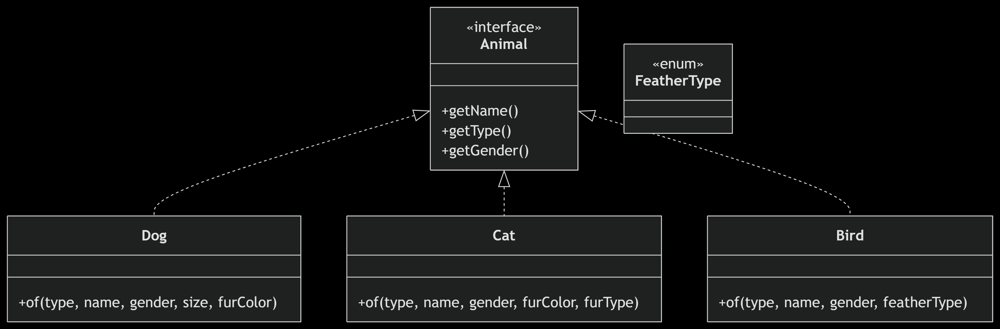

## Notes from item #1

- The static factory method helps to increase the testability;
- Some advantages of using static factory methods:
  - They can have names that are more descriptive than constructors;
  - They can return an instance of any subtype of their return type;
  - They can encapsulate the logic of instance creation, which can be useful for caching or pooling instances.
- The main disadvantage is that they cannot be used to create instances of the class in a subclass, which can limit flexibility in some cases.
  - In this project, an example of this is that returning an Animal instance from the static factory method in the Animal class does not allow for creating instances of subclasses like Dog or Cat directly because they lose their specific type information.
  - And I could have created the `of` method in the Animal interface, so it can call the most specific implementation of the static factory method in the concrete classes. But for that solution, it would be better to use a factory class instead of a static factory method in the interface or even use builder pattern.

## Classes diagram
This is a self exercising project to demonstrate the use of static factory methods in Java. It includes a simple hierarchy of animals with a static factory method in the `Animal` class that returns an instance of `Animal`. The project also includes a test class to verify the functionality of the static factory method.

